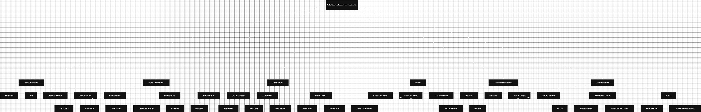

## 🧱 Backend Architecture Overview

This section outlines the high-level structure of the backend system, which follows a layered architectural pattern. The goal is to ensure **clean separation of concerns**, **easy scalability**, and **maintainability** across all services.

---

### 📚 Layered Architecture

**🔹 Presentation Layer**
Handles all incoming API requests and routes them to the appropriate services.
**Modules:**

* API Gateway
* Auth Controller
* User Controller
* Property Controller
* Booking Controller
* Payment Controller
* Review Controller
* Messaging Controller

**🔹 Application Layer**
Orchestrates business logic and coordinates actions between controllers and domain rules.
**Modules:**

* Auth Service
* User Service
* Property Service
* Booking Service
* Payment Service
* Review Service
* Messaging Service

**🔹 Domain Layer**
Encapsulates core business rules, domain logic, and policies that drive data behavior.
**Modules:**

* Roles & Permissions
* Booking Rules
* Pricing Logic
* Payment Verification
* Review Validation
* Messaging Logic

**🔹 Persistence Layer**
Abstracts and handles all database operations and queries.
**Modules:**

* User Repository
* Property Repository
* Booking Repository
* Payment Repository
* Review Repository
* Message Repository

**🔹 Database Layer**
Represents the actual relational database tables that store persistent data.
**Entities:**

* `User`
* `Property`
* `Booking`
* `Payment`
* `Review`
* `Message`
* `Role`
* `PaymentMethod`
* `BookingStatus`

---

### 🔄 Use Case Flows

**👤 User Registration**

```
Auth Controller → Auth Service → Roles & Permissions → User Repository → User Table
```

**🏠 Property Management**

```
Property Controller → Property Service → Property Repository → Property Table
```

**📅 Booking Creation**

```
Booking Controller → Booking Service → Booking Rules → Booking Repository → Booking Table → BookingStatus Table
```

**💳 Payment Processing**

```
Payment Controller → Payment Service → Payment Verification → Payment Repository → Payment Table → PaymentMethod Table
```

---

### 🧰 Diagram Tool

The system architecture diagram was built using [draw.io](https://draw.io).
It provides a visual overview of how layers interact and is helpful for onboarding, debugging, and extending the system.

---