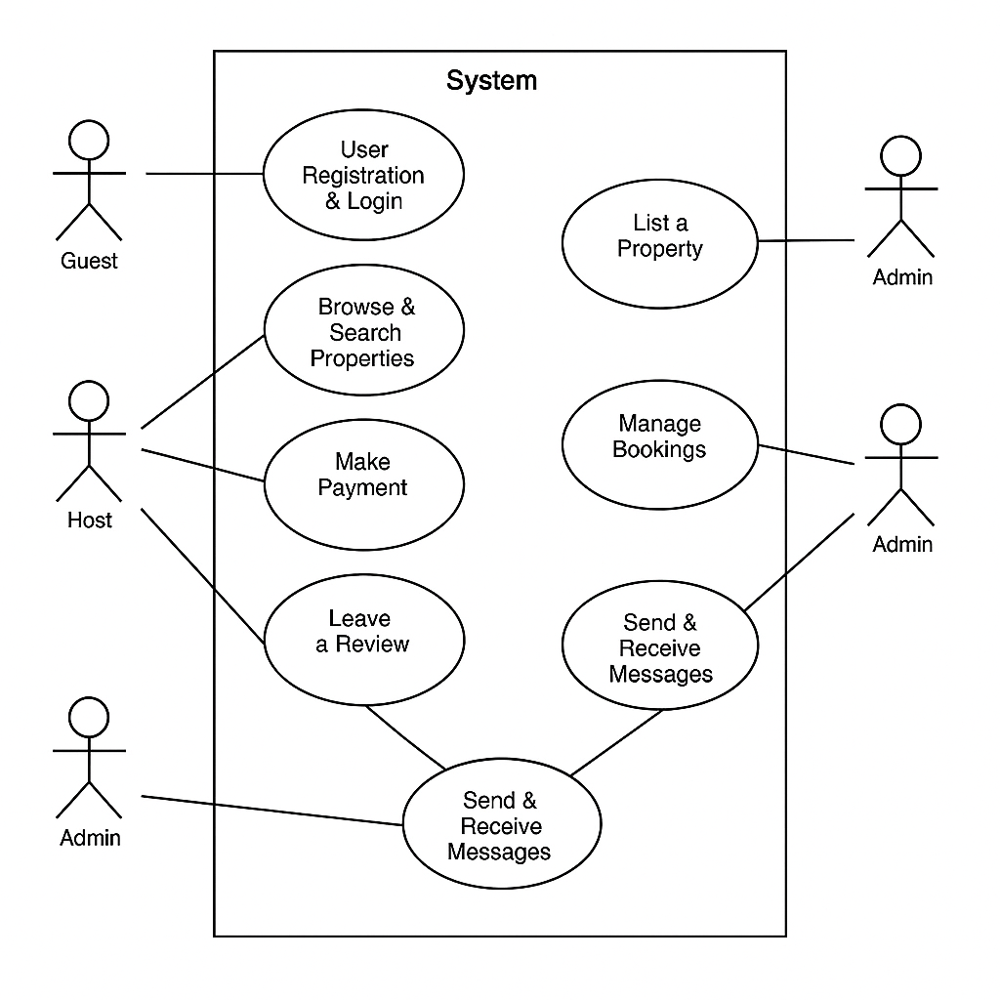

Sure! Here's documentation info in **README-style markdown** that describes the system's architecture and key modules (user authentication, property management, booking system, and payments), including use case descriptions:

```markdown
# 🏡 Property Booking Platform Backend

This backend system powers a property booking platform similar to Airbnb. It handles user authentication, property listings, messaging, booking, payments, and reviews.

---

## 🧱 System Architecture Overview

The system follows a **modular layered architecture**, consisting of:

- **Presentation Layer (Client App)**
- **Backend API Layer (Business Logic)**
- **Data Access Layer (ORM/SQL)**
- **Database Layer (PostgreSQL / MySQL)**

Each module is designed with maintainability, scalability, and security in mind.

---

## 📦 Functional Modules

### 🔐 User Authentication
Handles user registration, login, password management, and role-based access.

**Features:**
- User registration & login
- Password hashing & security
- Role management (guest, host, admin)
- Token-based authentication (JWT)

### 🏠 Property Management
Allows hosts to list properties and manage their information.

**Features:**
- Create, edit, delete properties
- Set price, description, location
- View listings as a host

### 📅 Booking System
Enables users to book available properties.

**Features:**
- Select dates for check-in/check-out
- Real-time availability checking
- Booking status tracking (pending, confirmed, canceled)
- Price calculation per night

### 💳 Payment System
Handles secure payment processing linked to bookings.

**Features:**
- Payment method selection (Stripe, PayPal, credit card)
- Secure checkout process
- Store transaction details
- Generate receipts

### 💬 Messaging System
Supports communication between hosts and guests.

**Features:**
- Direct messaging
- Time-stamped messages
- Sender/receiver tracking

### ⭐ Review System
Allows users to leave reviews for properties after bookings.

**Features:**
- One review per booking per user
- Star rating (1–5)
- Comments

---

## 🧑‍💻 Use Case Flows

### 1. User Registers
**Actor:** Guest/Host  
**Flow:**  
- Enters details → Password hashed → Role assigned → Account created

### 2. Host Lists Property
**Actor:** Host  
**Flow:**  
- Logs in → Adds property → Enters details → Saves → Becomes publicly visible

### 3. Guest Books a Property
**Actor:** Guest  
**Flow:**  
- Searches listings → Selects property → Chooses dates → Booking created → Status: pending

### 4. Payment Processing
**Actor:** Guest  
**Flow:**  
- Booking confirmed → Selects payment method → Makes payment → Status: confirmed

### 5. Messaging
**Actors:** Guest, Host  
**Flow:**  
- After booking → User sends/receives messages → Messages stored with timestamps

---

## 🔗 Entity Relationships (Key Tables)

- `User` → owns → `Role`
- `User` → creates → `Property`
- `User` ↔ books ↔ `Property` → via `Booking`
- `Booking` → has → `Payment`
- `User` ↔ sends ↔ `Message`
- `User` ↔ reviews ↔ `Property`

---